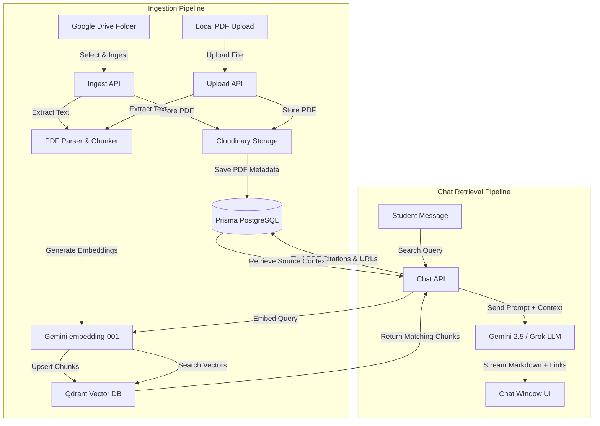

# SPPU University Chatbot & Resource Hub (UniChatbot)

UniChatbot is a next-generation Retrieval-Augmented Generation (RAG) study assistant and official circulars dashboard designed for students of Savitribai Phule Pune University (SPPU). It enables students to query exam patterns, schedules, and study materials while keeping track of official university notifications in real-time.

---

## 🚀 Key Features

* **Folder-Browsable Document Ingestion**: Navigable, breadcrumb-supported folder browsing directly synced with Google Drive. Allows moderators to selectively ingest course-specific PDFs.
* **Direct PDF Uploader**: Upload local study resources. The files are securely stored on Cloudinary, chunked, and vectorized automatically.
* **Smart RAG Chat System**: Retrieval-Augmented Generation using vector search via Qdrant and response generation via Google Gemini (`gemini-2.5-flash`) or Grok (`grok-beta` / `llama-3.3-70b-versatile` via Groq).
* **Inline Hyperlink Citations**: The chatbot automatically highlights key details and links directly to the specific page/resource on Cloudinary using citation hyperlinks.
* **3D Mascot Assistant (UniBot)**: An interactive 3D WebGL robot mascot rendered using Three.js that floats and dynamically tracks the user's mouse movements.
* **Live SPPU Circulars Feed**: Automatic scraper and dashboard for Pune University exam timetables, PG admissions notifications, and state scholarships.
* **Role-Based Auth System**: Student and Moderator accounts utilizing secure PBKDF2 password hashing and JWT cookie sessions.

---

## 🛠️ Tech Stack

* **Frontend**: Next.js 16 (App Router), React 19, Tailwind CSS, Lucide React icons
* **3D Visuals**: Three.js (WebGL Canvas)
* **Backend**: Next.js Server Actions & API Routes, Prisma ORM
* **Databases**:
  * PostgreSQL (Relational metadata, users, chat sessions, documents)
  * Qdrant (Vector Database storing 3072-dimensional embeddings)
* **AI Models**:
  * Text Generation: Google Gemini 2.5 Flash, Grok-Beta / Llama 3.3 70B
  * Embeddings: `gemini-embedding-001` (3072 dimensions)
* **Storage & Integrations**:
  * Cloudinary API (PDF resource hosting)
  * Google Drive API v3 (Resource synchronization)

---

## 📊 System Architecture & Data Flow



---

## 📁 Repository Structure

```text
├── prisma/
│   ├── schema.prisma           # Prisma PostgreSQL database schema
├── public/                     # Static assets (favicons, svgs)
├── src/
│   ├── app/
│   │   ├── api/                # API Endpoints
│   │   │   ├── auth/           # Login, logout, register, session validation
│   │   │   ├── chat/           # RAG chat logic, context search, LLM completion
│   │   │   ├── ingest/         # Google Drive folder/file traversal & sync
│   │   │   ├── sppu-circulars/ # Livestreaming circular feed scraper
│   │   │   ├── upload/         # Local file parsing & embedding pipeline
│   │   ├── login/              # Auth pages
│   │   ├── register/           # Signup page
│   │   ├── globals.css         # Tailwind directives & global styling
│   │   ├── layout.tsx          # Root template with metadata & fonts
│   │   ├── page.tsx            # Main chatbot dashboard layout
│   ├── components/
│   │   ├── ChatWindow.tsx      # Interactive chat messages and streaming
│   │   ├── DocManager.tsx      # Google Drive file browser and uploader
│   │   ├── MascotViewport.tsx  # Three.js 3D floating mascot viewport
│   │   ├── Sidebar.tsx         # Conversation history & database tools
│   │   ├── SppuHub.tsx         # Live circular feeds & university portals
│   ├── lib/
│   │   ├── auth.ts             # Password hashing & JWT helper utilities
│   │   ├── cloudinary.ts       # Cloudinary SDK wrapper
│   │   ├── gdrive.ts           # Google Drive authentication & list operations
│   │   ├── gemini.ts           # Gemini content generation & embedding helpers
│   │   ├── grok.ts             # Grok/Groq fetch interface
│   │   ├── llm.ts              # Unified LLM provider route manager
│   │   ├── parser.ts           # PDF text parser & recursive chunker
│   │   ├── prisma.ts           # PrismaClient DB connector singleton
│   │   ├── qdrant.ts           # Qdrant Client CRUD & collection initializers
│   │   ├── sppu.ts             # Curated circulars & site scraping logic
│   ├── types.ts                # TypeScript interfaces for mascot & settings
├── .env.example                # Template for environment configuration
├── .env                        # Local credentials (git-ignored)
├── package.json                # Project dependencies and run scripts
├── tsconfig.json               # TypeScript compiler options
```

---

## 🗄️ Database Models (PostgreSQL)

* **User**: Authenticated profiles. Relates to `Document` (uploaded files) and `ChatSession`.
* **Document**: Uploaded or ingested PDFs. Contains status tracking (`PENDING`, `PROCESSING`, `COMPLETED`, `FAILED`), Cloudinary source links, and Google Drive identifiers.
* **Chunk**: Split textual segments of a document. Connects directly to Qdrant vector indices via `qdrantId`.
* **ChatSession**: Groups message history for single sessions. Relates to `Message`.
* **Message**: Individual conversation instances (`role: "user" | "assistant"`).

---

## ⚙️ Setup and Installation

### 1. Clone the repository and install dependencies
```bash
npm install
```

### 2. Configure Environment Variables
Copy `.env.example` to `.env` and fill in the required keys:
```bash
cp .env.example .env
```
Ensure you provide:
* `DATABASE_URL`: A pooled/direct connection string for PostgreSQL (Neon/Supabase).
* `GEMINI_API_KEY`: Google AI Studio API key.
* `GROK_API_KEY`: xAI/Groq developer API key (optional fallback).
* `QDRANT_URL` & `QDRANT_API_KEY`: Qdrant Cloud or local Docker coordinates.
* `CLOUDINARY_CLOUD_NAME`, `CLOUDINARY_API_KEY`, `CLOUDINARY_API_SECRET`: Cloudinary API parameters.
* `GOOGLE_CLIENT_EMAIL` & `GOOGLE_PRIVATE_KEY`: Service account details for Drive crawling.
* `GOOGLE_DRIVE_FOLDER_ID`: Parent directory to index.
* `JWT_SECRET`: Secret key for signing tokens (`openssl rand -hex 32`).
* `MODERATOR_SIGNUP_CODE`: Security code required to register as a moderator (e.g. `sppuadmin123`).

### 3. Initialize the Database Schema
Push the Prisma schemas to your database to set up indexes:
```bash
npx prisma db push
```

### 4. Run the Development Server
```bash
npm run dev
```
Open [http://localhost:3000](http://localhost:3000) to access the dashboard.

---

## 🔌 API Endpoints Reference

### Authentication
* `POST /api/auth/register` - Create student/moderator accounts.
* `POST /api/auth/login` - Verify password and set session cookie.
* `POST /api/auth/logout` - Clear auth session cookies.
* `GET /api/auth/me` - Fetch currently logged in user info.

### Documents & Ingestion
* `GET /api/ingest?folderId=xxx` - List folder content (folders & files) from Google Drive and check sync statuses.
* `POST /api/ingest` - Ingest a selected file from Google Drive into Qdrant & Prisma.
* `POST /api/upload` - Handle direct PDF file upload, store on Cloudinary, chunk, and embed.

### Chat & Search
* `GET /api/chat?sessionId=xxx` - Load historical messages for a chat session.
* `POST /api/chat` - Perform vector search, query Prisma, construct prompt, and call LLM for answer stream.

### Circulars
* `GET /api/sppu-circulars` - Scrape exam.unipune.ac.in and merge with curated notices list.
